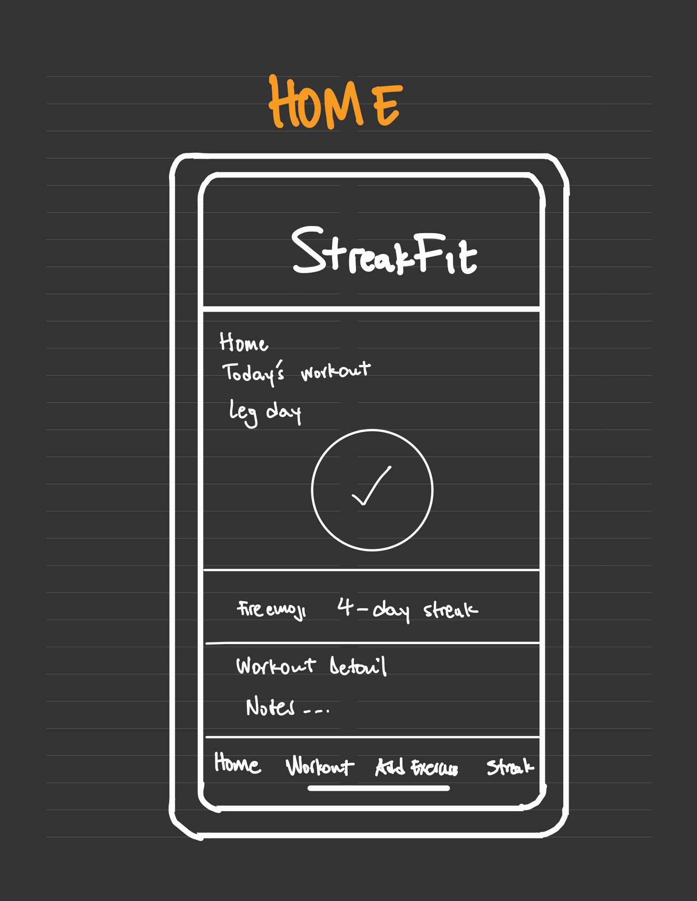
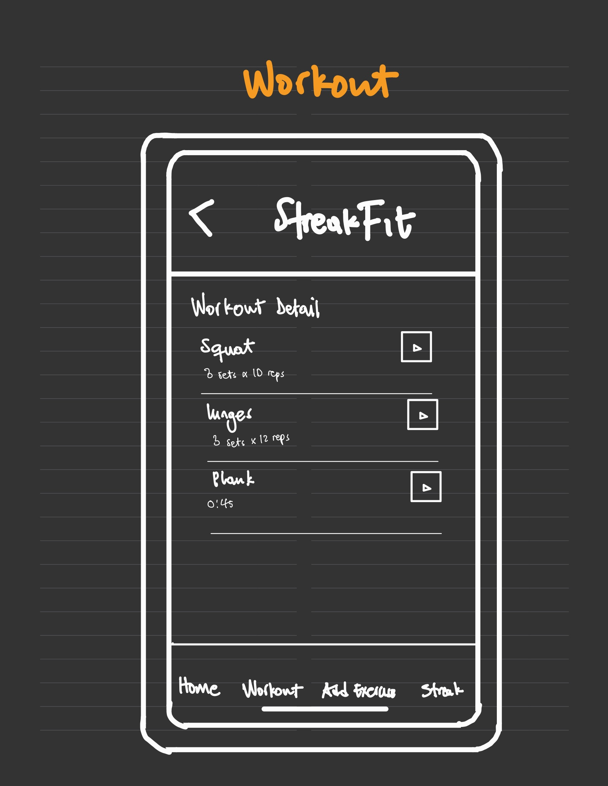
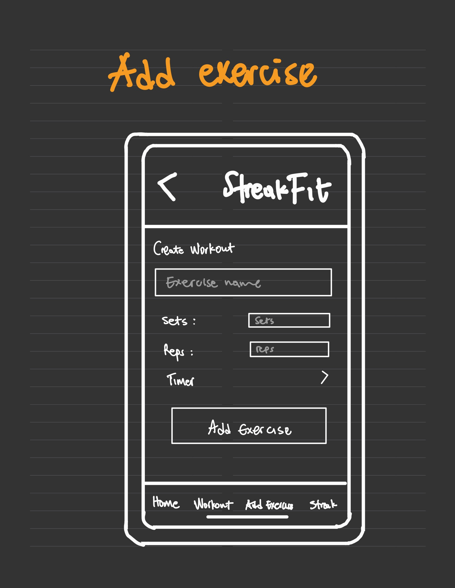
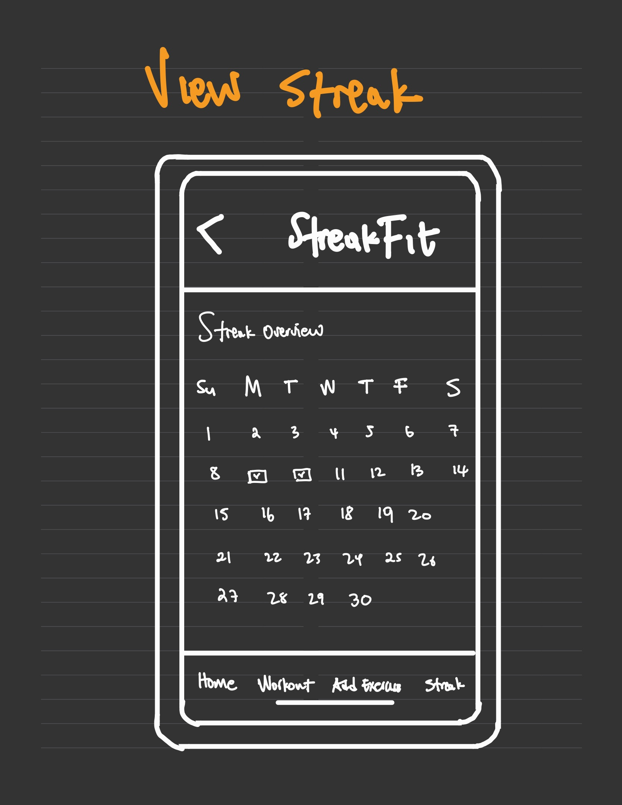

# StreakFit

## Table of Contents

1. [Overview](#Overview)
2. [Product Spec](#Product-Spec)
3. [Wireframes](#Wireframes)
4. [Schema](#Schema)

## Overview

### Description

StreakFit is a fitness tracker iOS app that helps users build consistent workout habits by allowing them to create custom workouts, set timers, reps, and sets, and check off exercises throughout the day. The app encourages consistency by tracking daily streaks and visualizing progress over time.

### App Evaluation

- **Category:** Health & Fitness
- **Mobile:** This app is native to iOS and will use Swift with SwiftUI.
- **Story:** The user creates workouts, adds exercises (sets, reps, timers), and checks off tasks as they go. Completion adds to their daily streak.
- **Market:** Anyone who wants to build a habit of working out, especially beginners and intermediate fitness enthusiasts.
- **Habit:** Encourages daily use with streak tracking and a focus on consistency.
- **Scope:** MVP includes workout creation, timers, exercise tracking, and streak visualization. Stretch goals may include Apple Health sync and analytics.

## Product Spec

### 1. User Stories (Required and Optional)

**Required Must-have Stories**
* User can create a workout
* User can add exercises to a workout
* User can specify reps, sets, and timers for each exercise
* User can check off an exercise once completed
* User can view current streak and see if they completed the workout for the day
* Data is saved locally (Core Data or UserDefaults)

**Optional Nice-to-have Stories**
* User receives a notification reminder for daily workouts
* User can sync data across devices using iCloud
* User can connect with Apple Health for progress tracking
* User sees charts or graphs of their weekly activity
* Haptic or audio feedback on timers
* Dark mode theme

### 2. Screen Archetypes

- **Home**
  * View today's workout
  * See current streak and total completed workouts
  * Navigate to workout or create a new one

  

- [ ] **Workout**
  * View list of exercises
  * Tap to check off each part (sets/reps/timer)
  * Start/stop timers for rest or exercise

  

- [ ] **Create Workout**
  * Input workout title
  * Add multiple exercises with sets/reps/timers

  

- [ ] **Streak Overview**
  * Visual tracker of past days completed
  * Calendar view or streak number with history

  

### 3. Navigation

**Tab Navigation** (Tab to Screen)

* Home
* Workout
* Create Workout
* Streaks

**Flow Navigation** (Screen to Screen)

- [ ] Home
  * → Workout
  * → Create Workout
  * → Streak Overview

- [ ] Create Workout
  * → Add Exercises

- [ ] Workout Detail
  * → Mark completion
  * → Return to Home

### Models

_Example model for Workout and Exercise (to be expanded):_

#### Workout
| Property | Type | Description |
|----------|------|-------------|
| id | UUID | Unique ID |
| title | String | Workout name |
| dateCreated | Date | When it was created |
| exercises | [Exercise] | Array of related exercises |

#### Exercise
| Property | Type | Description |
|----------|------|-------------|
| id | UUID | Unique ID |
| name | String | Name of the exercise |
| sets | Int | Number of sets |
| reps | Int | Number of reps per set |
| timer | Int | Optional time per set or rest (seconds) |

### Networking

- [No API use planned at MVP stage]
- [Optional future integration: Apple Health API]
